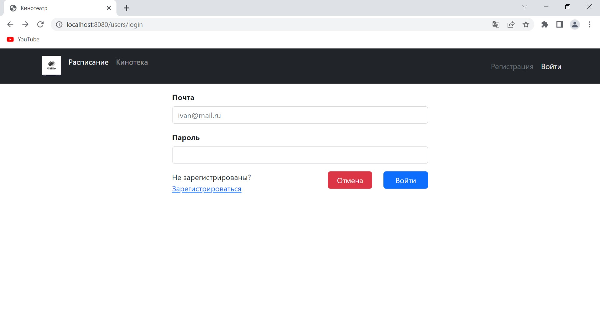
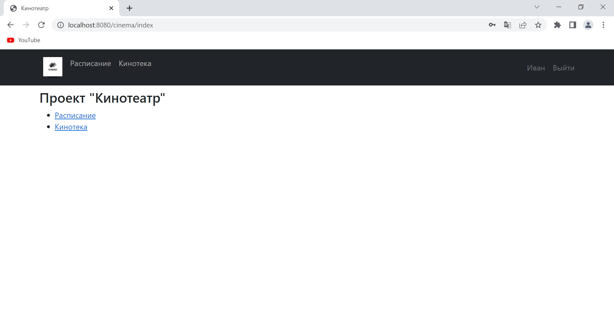
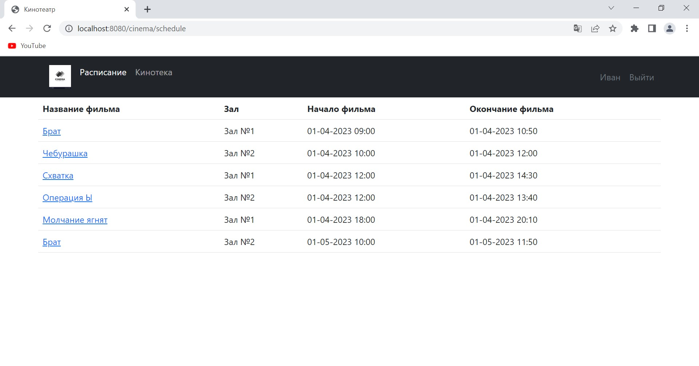
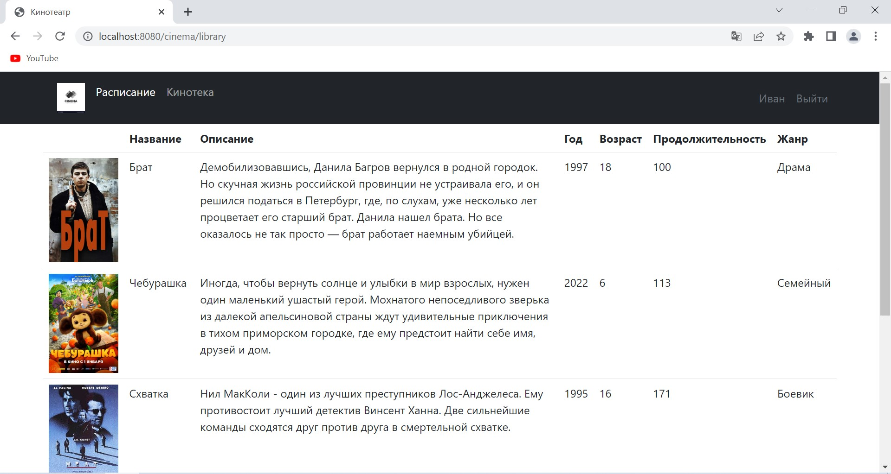
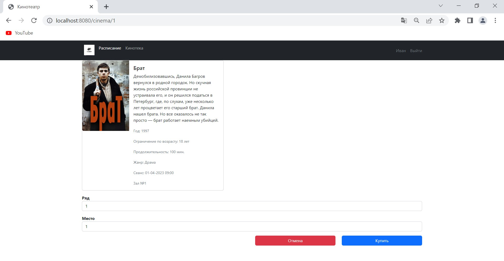

### Название проекта: 
***job4j_cinema***;
___
### Описание проекта: 
в проекте реализован функционал сайта по покупке билетов в кинотеатр в части логики регистрации/входа,
вывода киносеансов и фильмов, покупки билетов;
___
### Стек технологий: 
Spring Boot 5, Thymeleaf, Bootstrap, Liquibase, Sql2o, PostgreSQL 14;
___
### Требования к окружению: 
Java 17, Maven 3.8, PostgreSQL 14;
___
### Запуск проекта: 
+ Создать базу данных командой ```create database cinema```;
+ Запустить проект командой ```mvn spring-boot:run```;
___
### Взаимодействие с приложением:
 ***Основные виды приложения:***
+ *Страница регистрации*
  
+ *Главное меню*
  
+ *Расписание фильмов*
  
+ *Страница с описанием фильмов*
  
+ *Страница с выбором места и покупки билета*
  
___
### Контакты: 
Телеграм: @semi999rus